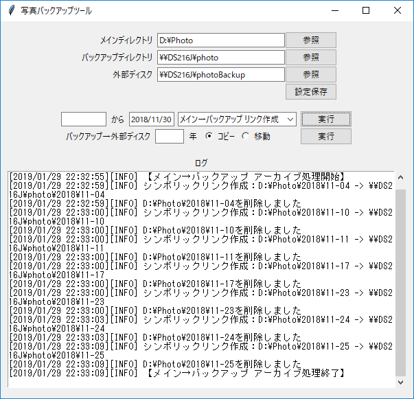

==========================================
Adobe Lightroom向け写真バックアップツール
==========================================

最近の写真はSSDや本体HDDに保存、
昔の写真はNASや外付けHDDなどに移動！

Lightroomから見ると、すべて本体側にあるように扱うことができます。
古い写真も、Lightroomの設定を変えることなく閲覧・編集が可能になるようにシンボリックリンクを使用しています。

---------------

特徴

1. 最近撮影した写真の編集時、RAWが速い本体HDDやSSDにあるからサクサク編集が可能

2. カメラから写真を取り込む時、非常に高速

3. Lightroomの設定変更なし大容量ストレージへの参照が簡単にできる

---------------

開発環境

- Python 3.7.2
- PyCharm

動作確認環境

- Windows 10
- macOS Mojave

-------------
実行イメージ

